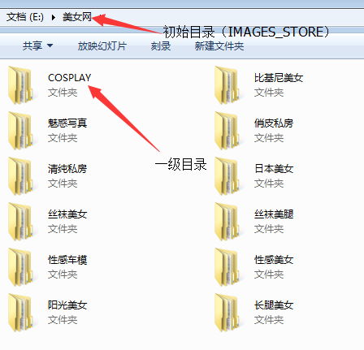
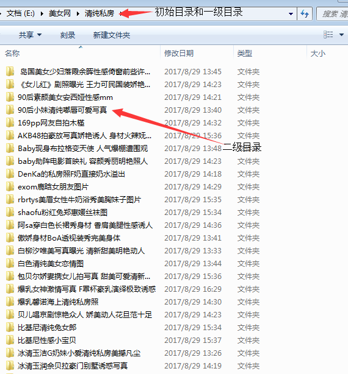
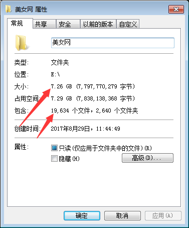
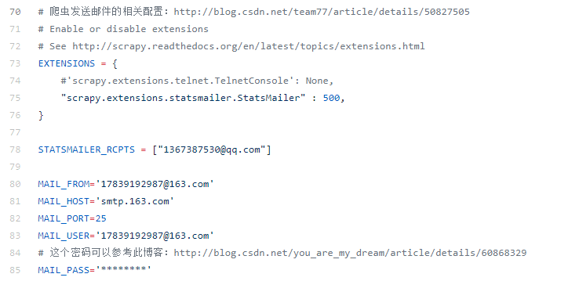

# 美女写真集爬取
用Scrapy爬取www.ycgkja.com所有分类的图片，并根据分类以及写真集名称实现分目录存储。

## 网站结构
首页 --> 12个category --> 每个category的所有写真集(里面有分页) --> 每个写真集的图片(获取每个页面的图片url) --> 图片分目录下载

## 目录结构
如图所示：

## 爬取的数据
对于每一个分类，获取到的数据如下：
  - category: 写真集分类
  - url: 写真集每张图片的url链接
  - title: 写真集标题
  - update_time: 更新时间
  - click_amount: 点击量
  - tags: 标签
  - content: 写真集简介

针对于爬取到的数据，这里只对下面的三个字段进行处理，category和title进行创建目录，根据url对图片进行下载。
(如果要在本机运行此示例代码，注意修改下对应的文件路径，settings.py中的IMAGES_STORE)

## 问题处理
 - response.meta 传值发生覆盖

在处理的时候发现response.meta传值的过程中发生了覆盖，把所有的图片都存入了一个目录中。
错误原因：二者公用的是同一个内存地址，使用深拷贝来拷贝内存地址，这样可以避免上面的错误。
 - 点击量获取

在代码解析的过程中，点击量不能获取到，看了下代码结构，发现那是通过js动态响应的值，所以在这里加了个从js中获取值的解析。

## 数据存储错误分析
MySQL数据库中存储的是获取到的7个字段，存储到本地。

数据库的创建语句已经给出了，里面的SQL已经测试通过。下面是写SQL的过程中遇到的问题。
- not all arguments converted during string formatting

执行insert的时候前后字段数量不一样
- Error 1064

MySQL语法错误
## 爬取速度
预计总共有6万张左右的照片需要下载，下面是在本地win7系统测试的结果。
- 图片下载速度

如下图所示，这里下载了部分图片，耗时大约6个小时，所以6万张图片如果全部都存储到本地，则大约耗时18小时左右。（预计如果在Linux或者Mac上面速度可能会更快）

- MySQL数据存储速度

这个只测试了代码逻辑是否正确，具体的耗时没有测试，不过在本地存储1万条数据大约耗时20分钟左右。所以总时间预计在2个小时左右。

- MySQL数据存储以及图片下载

如果说把代码全部放到一起的话，预计爬取耗时会在一天左右，毕竟图片下载相对比较耗时。

## 发送邮件
当爬取结束以后，通过发送邮件提示爬虫已经爬取结束，邮件内容为Scrapy内置的内容，并没有进行修改。

发送邮件只需要配置settings.py文件的相关字段即可，其它地方没有进行修改。

修改配置如图：

